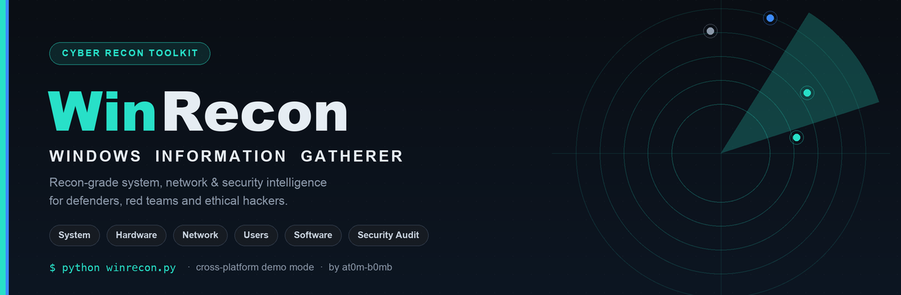
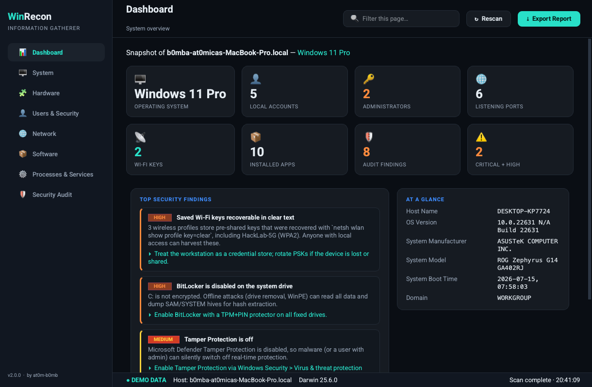
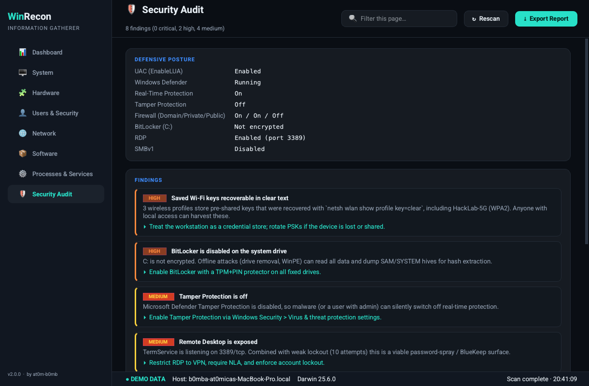
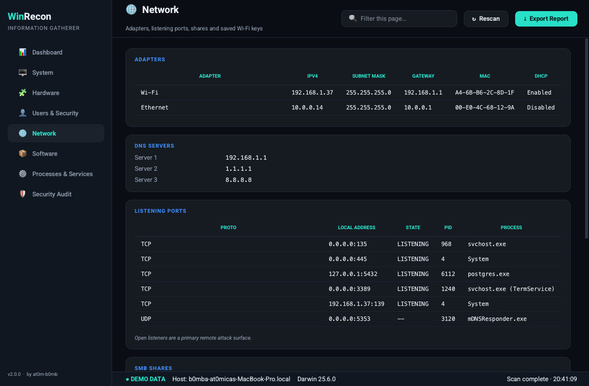
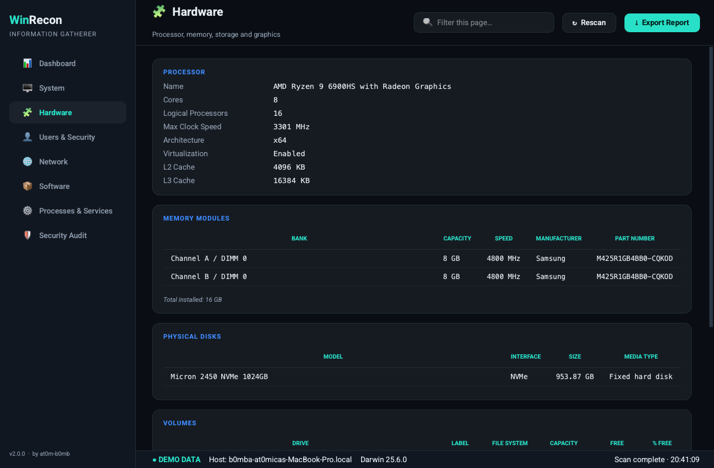
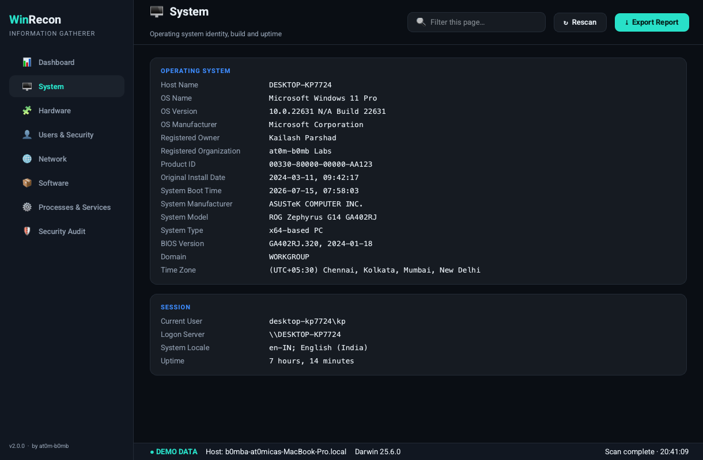
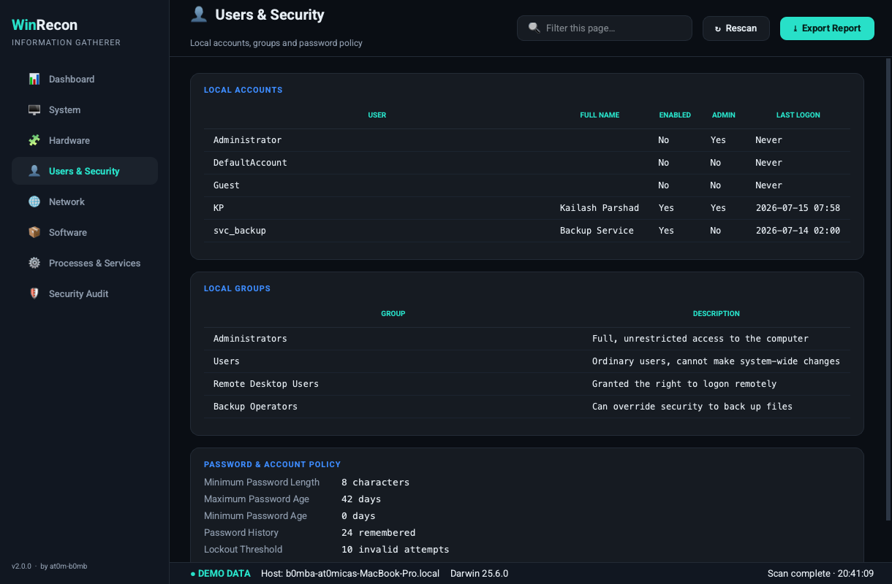
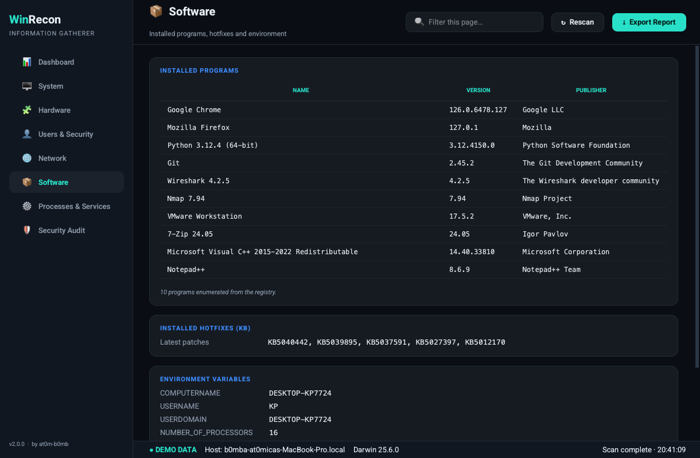
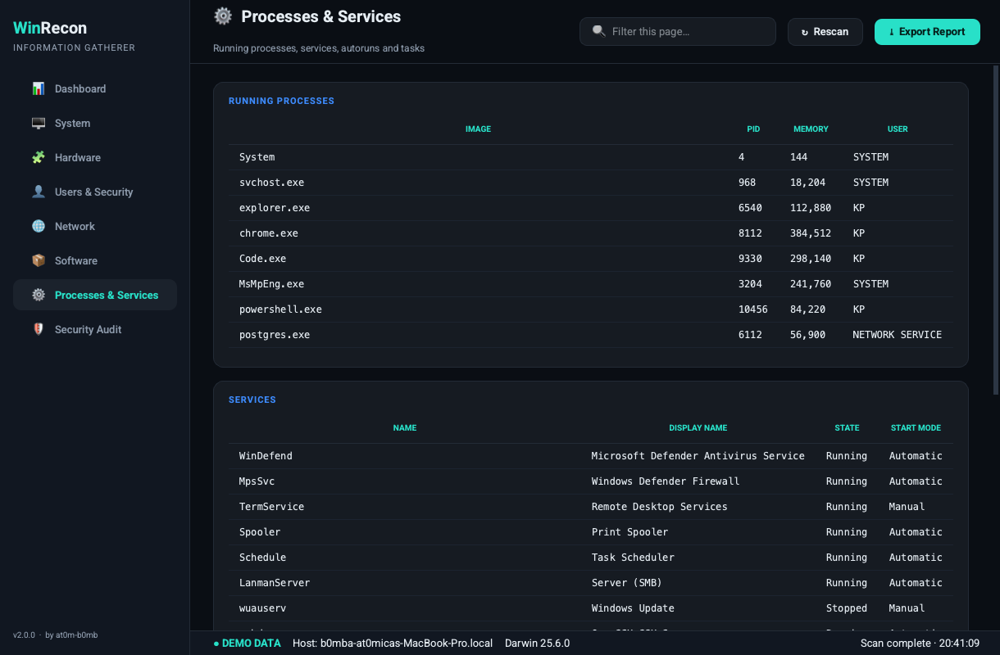

<!-- Banner -->
<p align="center">
  
</p>

<h1 align="center">WinRecon — Windows Information Gatherer</h1>

<p align="center">
  A modern, cross-platform <b>PyQt6 GUI</b> that collects almost everything worth
  knowing about a Windows host — system, hardware, users, network, software,
  processes and a built-in <b>security audit</b> — and exports it to a clean
  HTML, JSON or text report.
</p>

<p align="center">
  
  
  
  
  
</p>

---

## ✨ Overview

The original project was a single `.bat` script. **WinRecon v2** rebuilds it into a
full desktop application aimed at cybersecurity assessments and ethical hacking labs.
It gathers reconnaissance-grade intelligence into one polished dark-themed interface,
flags misconfigurations that matter, and produces a shareable report in one click.

Everything the tool does is **read-only**. It never changes a setting, installs
anything, or touches the network of another host — it only reads state that a
defender (or an attacker already on the box) would look at first.

> 🧪 **Runs anywhere.** On Windows it collects from the real machine. On macOS or
> Linux — or with `--demo` — it loads a realistic demo dataset so you can explore,
> screenshot and develop the UI on any OS.

---

## 🚀 Features

| Category | What it collects |
|----------|------------------|
| 🖥️ **System** | OS name/version/build, install date, boot time & uptime, manufacturer, model, BIOS, domain, registered owner, current session |
| 🧩 **Hardware** | CPU (cores/threads/clock/cache), memory modules (bank/speed/part), physical disks, volumes with free space, GPUs & drivers |
| 👤 **Users & Security** | Local accounts (enabled/admin/last logon), local groups, Administrators membership, password & lockout policy |
| 🌐 **Network** | Adapters (IPv4/mask/gateway/MAC/DHCP), DNS, **listening ports + PIDs**, SMB shares, and **saved Wi-Fi profiles with recovered keys** |
| 📦 **Software** | Installed programs (from the registry), hotfixes/KBs, key environment variables |
| ⚙️ **Processes & Services** | Running processes, services (state/start mode), startup/autorun items, non-Microsoft scheduled tasks |
| 🛡️ **Security Audit** | Defensive posture (UAC, Defender, Tamper Protection, firewall, BitLocker, RDP, SMBv1) plus prioritised **privilege-escalation & hardening findings** |

Plus:

- 📊 **Dashboard** with live stat tiles and the top security findings at a glance.
- 🔎 **Per-page live search** to filter any table or field instantly.
- 🧵 **Threaded scanning** so the UI never freezes while collecting.
- ⤓ **One-click export** to a self-contained **HTML** report, **JSON**, or **TXT**.
- 🖥️ **Headless CLI mode** (`--cli`) for servers and automation.

---

## 📸 Screenshots

<p align="center">
  
  
</p>
<p align="center">
  
  
</p>

<details>
<summary><b>More screenshots</b> (System · Users · Software · Processes)</summary>
<br>
<p align="center">
  
  
</p>
<p align="center">
  
  
</p>
</details>

---

## 📦 Installation

```bash
# 1. Clone
git clone https://github.com/at0m-b0mb/Windows-Info-Gatherer.git
cd Windows-Info-Gatherer

# 2. (Recommended) create a virtual environment
python -m venv .venv
# Windows:  .venv\Scripts\activate
# macOS/Linux:  source .venv/bin/activate

# 3. Install dependencies
pip install -r requirements.txt
```

Requires **Python 3.9+**. The only runtime dependency is **PyQt6**; everything
else uses the standard library.

---

## 🕹️ Usage

### GUI

```bash
python winrecon.py            # live scan on Windows, demo data elsewhere
python winrecon.py --demo     # force the demo dataset (great for demos/screenshots)
```

Use the sidebar to switch categories, the search box to filter the current page,
**↻ Rescan** to refresh, and **⤓ Export Report** to save an HTML/JSON/TXT file.

### CLI / headless

```bash
python winrecon.py --cli                     # print a text report to stdout
python winrecon.py --cli --html report.html  # write a styled HTML report
python winrecon.py --cli --json report.json  # machine-readable output
python winrecon.py --cli --txt  report.txt
```

For the most complete results on Windows, run from an **elevated (Administrator)**
prompt — some data (e.g. saved Wi-Fi keys, full service list) requires it.

---

## 🧠 How it works

```
winrecon.py            → entry point (GUI / CLI / --demo)
wig/
├─ collectors/         → one module per category; real Windows commands
│                        (systeminfo, PowerShell/CIM, netsh, netstat, net, sc, reg…)
│                        with graceful fallback + demo data
├─ model.py            → shared Category/Section/Finding data model
├─ report.py           → HTML / JSON / TXT exporters
├─ demo_data.py        → realistic demo dataset used off-Windows
└─ gui/                → PyQt6 theme, widgets, dashboard and main window
```

Each collector returns the same structured model, so the GUI and every export
format render from a single source of truth. Any command that isn't available
(for example `wmic` on newer Windows 11) simply degrades instead of crashing the scan.

---

## ⚖️ Legal & ethical use

> WinRecon is intended for **authorised security assessments, education and your
> own systems only**. Running reconnaissance or recovering credentials on machines
> you do not own or have explicit written permission to test may be illegal.
> You are responsible for how you use this tool.

---

## 🗺️ Roadmap

- [ ] Remote collection over WinRM / PsExec
- [ ] Full unquoted-service-path and weak-ACL privilege-escalation scanner
- [ ] CIS-benchmark scoring on the Security Audit page
- [ ] PDF export and report diffing between two scans

Contributions and ideas are welcome — open an issue or a pull request.

---

## 📄 License

MIT © [at0m-b0mb](https://github.com/at0m-b0mb) — see [LICENSE](LICENSE).

<p align="center"><sub>Built for the security community. Hack responsibly. 🛡️</sub></p>
